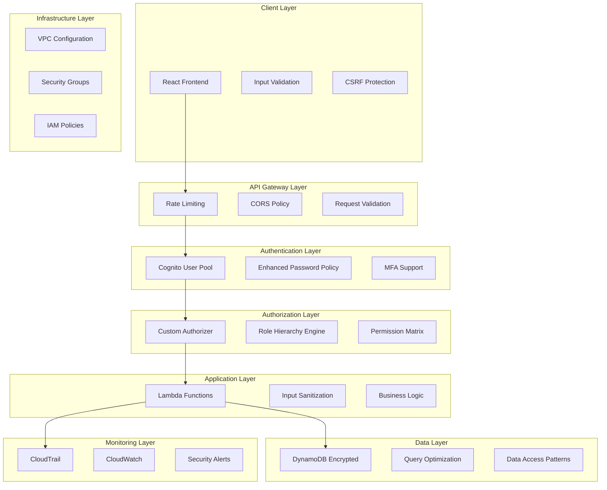

# Security Fixes Design Document

## Overview

This design document outlines the technical approach for implementing comprehensive security fixes across the task management system. The solution addresses critical vulnerabilities through a layered security approach, implementing defense-in-depth principles across authentication, authorization, data validation, infrastructure, and operational security.

The design prioritizes backward compatibility while significantly enhancing security posture. All changes will be implemented incrementally to minimize disruption while providing immediate security improvements.

## Architecture

### Security Architecture Layers



### Component Interaction Flow

1. **Request Flow**: Client → API Gateway → Authorizer → Lambda → DynamoDB
2. **Security Validation**: Each layer validates and sanitizes data
3. **Audit Trail**: All security events logged to CloudTrail
4. **Error Handling**: Secure error responses without information disclosure

## Components and Interfaces

### 1. Enhanced Authorization System

#### Role Hierarchy Engine

```typescript
interface RoleHierarchy {
  role: UserRole;
  permissions: Permission[];
  inheritsFrom?: UserRole[];
  priority: number;
}

interface Permission {
  resource: string;
  actions: string[];
  conditions?: PermissionCondition[];
}
```

#### Authorization Service

- **Purpose**: Centralized permission validation
- **Interface**: `validatePermission(userId: string, resource: string, action: string): Promise<boolean>`
- **Implementation**: Redis-cached permission matrix for performance

### 2. Input Validation Framework

#### Validation Schema Engine

```typescript
interface ValidationSchema {
  field: string;
  type: "string" | "number" | "date" | "email";
  required: boolean;
  constraints: ValidationConstraint[];
}

interface ValidationConstraint {
  type: "length" | "pattern" | "range" | "custom";
  value: any;
  message: string;
}
```

#### Sanitization Service

- **Purpose**: Clean and sanitize all user inputs
- **Methods**:
  - `sanitizeText(input: string): string`
  - `validateAndSanitize(data: any, schema: ValidationSchema[]): ValidationResult`

### 3. Secure Configuration Management

#### Environment-Specific CORS

```typescript
interface CorsConfig {
  development: {
    allowedOrigins: ["http://localhost:3000"];
    allowedMethods: ["GET", "POST", "PUT", "DELETE"];
    allowCredentials: true;
  };
  production: {
    allowedOrigins: string[]; // From environment variables
    allowedMethods: ["GET", "POST", "PUT", "DELETE"];
    allowCredentials: true;
  };
}
```

#### Security Headers Service

- **Purpose**: Consistent security headers across all responses
- **Headers**: CSP, HSTS, X-Frame-Options, X-Content-Type-Options

### 4. Database Security Layer

#### Encrypted Data Access

```typescript
interface SecureDataAccess {
  queryWithEncryption<T>(params: QueryParams): Promise<T[]>;
  putWithEncryption<T>(item: T): Promise<void>;
  validateDataAccess(userId: string, resourceId: string): Promise<boolean>;
}
```

#### Query Optimization Service

- **Purpose**: Replace Scan operations with efficient Query operations
- **Implementation**: GSI-based access patterns for role-based filtering

### 5. Error Handling System

#### Secure Error Response

```typescript
interface SecureErrorResponse {
  userMessage: string;
  errorCode: string;
  timestamp: string;
  requestId: string;
}

interface DetailedError extends SecureErrorResponse {
  internalDetails: string;
  stackTrace?: string;
  context: Record<string, any>;
}
```

#### Error Classification Service

- **Purpose**: Categorize errors and determine appropriate response level
- **Categories**: Authentication, Authorization, Validation, System, External

## Data Models

### Enhanced User Profile

```typescript
interface EnhancedUserProfile {
  userId: string;
  email: string;
  primaryRole: UserRole;
  additionalRoles: UserRole[];
  permissions: Permission[];
  securitySettings: {
    mfaEnabled: boolean;
    lastPasswordChange: string;
    failedLoginAttempts: number;
    accountLocked: boolean;
    lockoutExpiry?: string;
  };
  auditTrail: {
    createdAt: string;
    lastLogin: string;
    lastActivity: string;
    ipAddresses: string[];
  };
}
```

### Security Event Log

```typescript
interface SecurityEvent {
  eventId: string;
  userId?: string;
  eventType: "AUTH" | "AUTHZ" | "DATA_ACCESS" | "SECURITY_VIOLATION";
  action: string;
  resource?: string;
  result: "SUCCESS" | "FAILURE" | "BLOCKED";
  details: Record<string, any>;
  ipAddress: string;
  userAgent: string;
  timestamp: string;
  severity: "LOW" | "MEDIUM" | "HIGH" | "CRITICAL";
}
```

### Validation Schema Registry

```typescript
interface SchemaRegistry {
  taskCreation: ValidationSchema[];
  taskUpdate: ValidationSchema[];
  userProfile: ValidationSchema[];
  authentication: ValidationSchema[];
}
```

## Error Handling

### Error Classification Strategy

1. **Client Errors (4xx)**

   - Return specific validation errors
   - Hide internal implementation details
   - Provide actionable error messages

2. **Server Errors (5xx)**

   - Return generic error messages to client
   - Log detailed errors server-side
   - Trigger monitoring alerts

3. **Security Errors**
   - Log security events with full context
   - Return minimal information to client
   - Trigger immediate security alerts

### Error Response Format

```typescript
interface ErrorResponse {
  error: {
    code: string;
    message: string;
    details?: ValidationError[];
  };
  requestId: string;
  timestamp: string;
}
```

## Testing Strategy

### Security Testing Approach

1. **Unit Testing**

   - Authorization logic validation
   - Input validation and sanitization
   - Error handling scenarios

2. **Integration Testing**

   - End-to-end security flows
   - Role-based access control
   - API security testing

3. **Security Testing**

   - OWASP Top 10 vulnerability testing
   - Penetration testing scenarios
   - Infrastructure security validation

4. **Performance Testing**
   - Authorization performance under load
   - Database query optimization validation
   - Rate limiting effectiveness

### Test Data Strategy

- Use synthetic test data for security testing
- Implement data masking for production-like testing
- Automated security regression testing

## Implementation Phases

### Phase 1: Core Security Infrastructure

- Enhanced authorization system
- Input validation framework
- Secure error handling
- Database encryption

### Phase 2: Network and Infrastructure Security

- CORS configuration
- VPC setup
- Rate limiting
- Security headers

### Phase 3: Monitoring and Compliance

- CloudTrail integration
- Security event logging
- Compliance reporting
- Automated security testing

### Phase 4: Advanced Security Features

- MFA implementation
- Advanced threat detection
- Security automation
- Performance optimization

## Security Considerations

### Data Protection

- All sensitive data encrypted at rest and in transit
- PII handling according to privacy regulations
- Data retention and deletion policies

### Access Control

- Principle of least privilege
- Regular access reviews
- Automated permission auditing

### Monitoring and Alerting

- Real-time security event monitoring
- Automated incident response
- Compliance reporting and auditing

### Business Continuity

- Security incident response procedures
- Backup and recovery for security configurations
- Disaster recovery testing including security components
