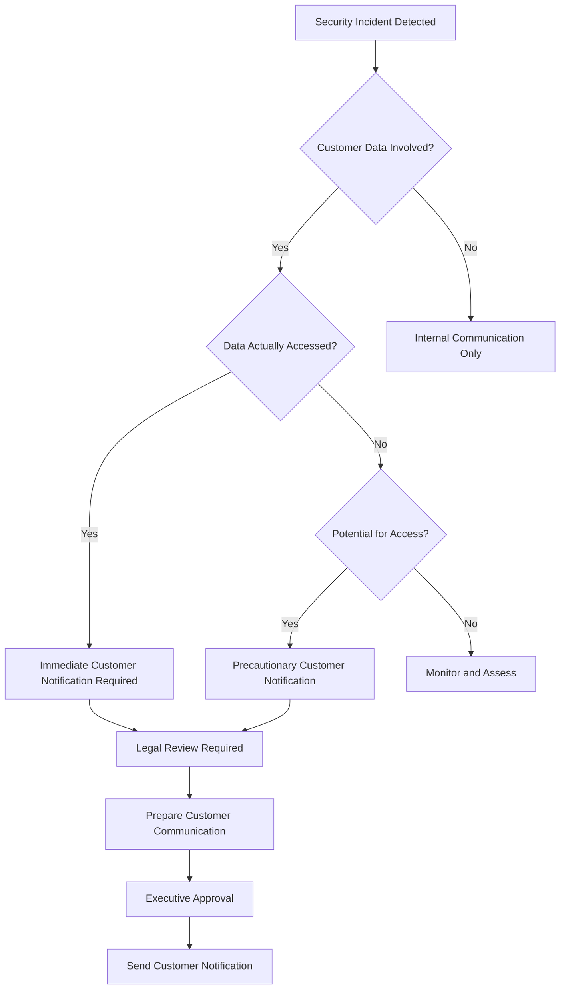

# Security Incident Response and Escalation Procedures

## Overview

This document establishes comprehensive procedures for security incident response and escalation within the Task Management System. It defines roles, responsibilities, communication protocols, and step-by-step procedures to ensure rapid and effective response to security incidents.

## Incident Response Team Structure

### 1. Core Response Team

#### Incident Commander

- **Primary**: Security Team Lead
- **Backup**: Senior Security Engineer
- **Responsibilities**:
  - Overall incident coordination
  - Decision-making authority
  - Stakeholder communication
  - Resource allocation
  - Post-incident review leadership

#### Security Analyst

- **Primary**: Security Engineer
- **Backup**: Junior Security Analyst
- **Responsibilities**:
  - Initial incident assessment
  - Evidence collection and preservation
  - Technical analysis and investigation
  - Containment action implementation

#### Technical Lead

- **Primary**: Senior Software Engineer
- **Backup**: DevOps Engineer
- **Responsibilities**:
  - System expertise and technical guidance
  - Implementation of technical remediation
  - System recovery coordination
  - Performance impact assessment

#### Communications Lead

- **Primary**: Engineering Manager
- **Backup**: Product Manager
- **Responsibilities**:
  - Internal stakeholder communication
  - External communication coordination
  - Documentation and reporting
  - Media relations (if required)

### 2. Extended Response Team

#### Legal Counsel

- **Role**: Legal and regulatory guidance
- **Escalation**: For incidents involving data breaches, regulatory compliance, or legal implications

#### Compliance Officer

- **Role**: Regulatory compliance assessment
- **Escalation**: For incidents affecting regulatory requirements (GDPR, CCPA, etc.)

#### Executive Leadership

- **CISO**: Strategic security decisions
- **CTO**: Technical architecture decisions
- **CEO**: Business impact decisions and external communications

#### External Partners

- **AWS Support**: Infrastructure-related incidents
- **Security Vendor**: Advanced threat analysis
- **Legal Firm**: External legal counsel
- **PR Agency**: Public relations support

## Incident Classification and Escalation Matrix

### 1. Severity Classification

#### Critical (P0) - Immediate Response

**Definition**: Immediate threat to system security, active data breach, or system compromise

**Examples**:

- Active data exfiltration
- System compromise with admin access
- Ransomware or malware infection
- Complete system outage due to security incident
- Confirmed data breach with PII exposure

**Response Time**: 15 minutes
**Escalation**: CISO, CTO, CEO (immediate)
**Communication**: All stakeholders within 30 minutes

#### High (P1) - Urgent Response

**Definition**: Significant security risk requiring immediate attention

**Examples**:

- Suspected data breach
- Privilege escalation attempts
- Multiple failed authentication attempts from single source
- Suspicious administrative activities
- Security control bypass

**Response Time**: 1 hour
**Escalation**: CISO, Engineering Manager
**Communication**: Security team and management within 2 hours

#### Medium (P2) - Standard Response

**Definition**: Security concern requiring investigation and response

**Examples**:

- Policy violations
- Suspicious user behavior
- Failed security controls
- Vulnerability exploitation attempts
- Unusual network traffic patterns

**Response Time**: 4 hours
**Escalation**: Security Team Lead
**Communication**: Security team within 8 hours

#### Low (P3) - Routine Response

**Definition**: Minor security issue or informational alert

**Examples**:

- Configuration drift alerts
- Routine security events
- Minor policy violations
- Informational security alerts
- Scheduled security maintenance

**Response Time**: 24 hours
**Escalation**: Assigned security engineer
**Communication**: Security team within 48 hours

### 2. Escalation Triggers

#### Automatic Escalation Triggers

```yaml
# Escalation Rules Configuration
escalation_rules:
  severity_based:
    P0:
      immediate: [CISO, CTO, Security_Team_Lead]
      after_30min: [CEO, Legal_Counsel]
    P1:
      immediate: [Security_Team_Lead, Engineering_Manager]
      after_2hours: [CISO]
    P2:
      immediate: [Security_Engineer]
      after_8hours: [Security_Team_Lead]

  time_based:
    no_response_15min: escalate_one_level
    no_resolution_2hours: escalate_to_management
    no_resolution_24hours: escalate_to_executive

  impact_based:
    customer_data_involved: add_legal_counsel
    regulatory_compliance: add_compliance_officer
    media_attention: add_pr_team
```

#### Manual Escalation Criteria

- Incident complexity exceeds team capabilities
- Resource requirements beyond available capacity
- Legal or regulatory implications identified
- Media attention or public disclosure required
- Customer notification necessary

## Incident Response Procedures

### 1. Detection and Initial Response

#### Detection Sources

- **Automated Monitoring**: CloudWatch alarms, security event logs
- **User Reports**: Customer complaints, employee observations
- **External Notifications**: Security researchers, partners, vendors
- **Routine Audits**: Security assessments, compliance reviews

#### Initial Response Checklist (First 15 Minutes)

```markdown
## Incident Response Initial Checklist

### Immediate Actions (0-5 minutes)

- [ ] Acknowledge incident alert
- [ ] Assign incident commander
- [ ] Create incident tracking ticket (INC-YYYY-NNNN)
- [ ] Start incident timeline documentation
- [ ] Notify core response team

### Assessment Actions (5-10 minutes)

- [ ] Perform initial impact assessment
- [ ] Classify incident severity
- [ ] Identify affected systems and data
- [ ] Determine if containment is needed
- [ ] Assess if escalation is required

### Communication Actions (10-15 minutes)

- [ ] Notify stakeholders per escalation matrix
- [ ] Set up incident response communication channel
- [ ] Prepare initial incident summary
- [ ] Schedule first status update
- [ ] Document all actions taken
```

### 2. Containment Procedures

#### Immediate Containment Actions

**Authentication Incidents**

```bash
# Disable compromised user account
aws cognito-idp admin-disable-user \
  --user-pool-id us-east-1_XXXXXXXXX \
  --username COMPROMISED_USERNAME

# Revoke all active sessions
aws cognito-idp admin-user-global-sign-out \
  --user-pool-id us-east-1_XXXXXXXXX \
  --username COMPROMISED_USERNAME

# Block suspicious IP addresses
aws wafv2 update-ip-set \
  --scope CLOUDFRONT \
  --id IP_SET_ID \
  --addresses SUSPICIOUS_IP/32
```

**System Compromise**

```bash
# Isolate affected Lambda functions
aws lambda put-function-concurrency \
  --function-name AFFECTED_FUNCTION \
  --reserved-concurrent-executions 0

# Update security groups to block traffic
aws ec2 revoke-security-group-ingress \
  --group-id sg-XXXXXXXXX \
  --protocol tcp \
  --port 443 \
  --source-group sg-XXXXXXXXX
```

**Data Breach**

```bash
# Create immediate backup
aws dynamodb create-backup \
  --table-name TaskManagerTable-prod \
  --backup-name incident-backup-$(date +%Y%m%d-%H%M%S)

# Enable additional logging
aws logs put-retention-policy \
  --log-group-name /taskmanager/security \
  --retention-in-days 90
```

#### Containment Decision Matrix

| Incident Type      | Immediate Action     | Secondary Action     | Approval Required  |
| ------------------ | -------------------- | -------------------- | ------------------ |
| Account Compromise | Disable account      | Revoke sessions      | Security Lead      |
| System Compromise  | Isolate system       | Block network access | Incident Commander |
| Data Breach        | Stop data access     | Create backup        | CISO               |
| DDoS Attack        | Enable rate limiting | Block source IPs     | Technical Lead     |
| Malware Detection  | Quarantine system    | Scan other systems   | Security Lead      |

### 3. Investigation Procedures

#### Evidence Collection Protocol

```bash
# Create investigation workspace
mkdir -p incident/INC-$(date +%Y%m%d)-001
cd incident/INC-$(date +%Y%m%d)-001

# Collect system logs
aws logs filter-log-events \
  --log-group-name /taskmanager/security \
  --start-time $(date -d '24 hours ago' +%s)000 \
  --end-time $(date +%s)000 \
  --output json > security-logs.json

# Collect CloudTrail logs
aws logs filter-log-events \
  --log-group-name CloudTrail/TaskManagerSecurityTrail \
  --start-time $(date -d '24 hours ago' +%s)000 \
  --end-time $(date +%s)000 \
  --output json > cloudtrail-logs.json

# Collect application logs
aws logs filter-log-events \
  --log-group-name /aws/lambda/TaskManagerFunction \
  --start-time $(date -d '24 hours ago' +%s)000 \
  --end-time $(date +%s)000 \
  --output json > application-logs.json

# Create evidence manifest
cat > evidence-manifest.md << EOF
# Evidence Collection Manifest

## Incident Information
- Incident ID: INC-$(date +%Y%m%d)-001
- Collection Date: $(date)
- Collector: $(whoami)
- Chain of Custody: Security Team

## Evidence Files
- security-logs.json: Security event logs (24 hours)
- cloudtrail-logs.json: AWS API call logs (24 hours)
- application-logs.json: Application logs (24 hours)
- system-state.json: Current system configuration
- network-logs.json: Network traffic logs (if available)

## Hash Verification
$(find . -name "*.json" -exec sha256sum {} \;)
EOF
```

#### Investigation Workflow

1. **Timeline Reconstruction**

   - Merge all log sources by timestamp
   - Identify sequence of events
   - Correlate user actions with system events

2. **Impact Assessment**

   - Determine scope of compromise
   - Identify affected data and systems
   - Assess business impact

3. **Root Cause Analysis**

   - Identify attack vector
   - Determine how security controls failed
   - Analyze contributing factors

4. **Attribution Analysis**
   - Identify threat actor (if possible)
   - Determine motivation and capabilities
   - Assess likelihood of repeat attacks

### 4. Recovery Procedures

#### Recovery Planning

```markdown
## Recovery Plan Template

### Pre-Recovery Checklist

- [ ] Threat has been contained and eliminated
- [ ] Root cause has been identified and addressed
- [ ] Security controls have been strengthened
- [ ] Recovery procedures have been tested
- [ ] Stakeholders have been notified of recovery plan

### Recovery Steps

1. **System Restoration**

   - Restore from clean backups
   - Apply security patches and updates
   - Reconfigure security controls
   - Verify system integrity

2. **Data Recovery**

   - Restore data from verified clean backups
   - Validate data integrity
   - Verify no unauthorized modifications
   - Test data access controls

3. **Service Restoration**
   - Gradually restore service functionality
   - Monitor for signs of continued compromise
   - Validate security controls are functioning
   - Confirm user access is working properly

### Post-Recovery Validation

- [ ] All systems are functioning normally
- [ ] Security controls are operational
- [ ] No signs of continued compromise
- [ ] User access is restored appropriately
- [ ] Monitoring and alerting is functional
```

#### Recovery Validation Tests

```bash
# Test authentication system
curl -X POST https://api.yourdomain.com/auth/login \
  -H "Content-Type: application/json" \
  -d '{"username": "test@example.com", "password": "TestPassword123!"}'

# Test authorization controls
curl -X GET https://api.yourdomain.com/tasks \
  -H "Authorization: Bearer VALID_TOKEN"

# Test input validation
curl -X POST https://api.yourdomain.com/tasks \
  -H "Authorization: Bearer VALID_TOKEN" \
  -H "Content-Type: application/json" \
  -d '{"title": "<script>alert(\"test\")</script>", "description": "test"}'

# Test rate limiting
for i in {1..110}; do
  curl -X GET https://api.yourdomain.com/health &
done
wait
```

## Communication Procedures

### 1. Internal Communication

#### Communication Channels

- **Primary**: Dedicated incident response Slack channel
- **Secondary**: Email distribution lists
- **Emergency**: Phone/SMS for critical escalations
- **Documentation**: Incident tracking system

#### Communication Templates

**Initial Incident Notification**

```
Subject: [SECURITY INCIDENT] P{SEVERITY} - {BRIEF_DESCRIPTION}

INCIDENT ALERT - IMMEDIATE ATTENTION REQUIRED

Incident Details:
- Incident ID: {INCIDENT_ID}
- Severity: P{SEVERITY}
- Detection Time: {TIMESTAMP}
- Affected Systems: {SYSTEMS}
- Initial Assessment: {DESCRIPTION}

Response Team:
- Incident Commander: {NAME}
- Security Analyst: {NAME}
- Technical Lead: {NAME}

Current Status:
- Containment: {IN_PROGRESS/COMPLETED}
- Investigation: {IN_PROGRESS/COMPLETED}
- Recovery: {NOT_STARTED/IN_PROGRESS/COMPLETED}

Next Update: {TIMESTAMP}

For questions, contact: {INCIDENT_COMMANDER_CONTACT}
```

**Status Update Template**

```
Subject: [SECURITY INCIDENT] {INCIDENT_ID} - Status Update #{NUMBER}

Incident Status Update

Current Status:
- Containment: {STATUS_DESCRIPTION}
- Investigation: {STATUS_DESCRIPTION}
- Recovery: {STATUS_DESCRIPTION}

Recent Actions Taken:
- {ACTION_1} - Completed at {TIME}
- {ACTION_2} - Completed at {TIME}
- {ACTION_3} - In progress

Key Findings:
- {FINDING_1}
- {FINDING_2}

Next Steps:
- {NEXT_STEP_1} - ETA: {TIME}
- {NEXT_STEP_2} - ETA: {TIME}

Impact Assessment:
- Systems Affected: {SYSTEMS}
- Data Impact: {DESCRIPTION}
- Business Impact: {DESCRIPTION}

Next Update: {TIMESTAMP}
```

### 2. External Communication

#### Customer Communication Decision Tree



#### Customer Notification Template

```
Subject: Important Security Notice - {COMPANY_NAME}

Dear {CUSTOMER_NAME},

We are writing to inform you of a security incident that may have affected your account information.

What Happened:
{INCIDENT_DESCRIPTION}

What Information Was Involved:
{DATA_TYPES_AFFECTED}

What We Are Doing:
- Immediately secured the affected systems
- Launched a comprehensive investigation
- Implemented additional security measures
- Notified law enforcement and regulatory authorities as required

What You Can Do:
- Change your password immediately
- Monitor your account for unusual activity
- Enable multi-factor authentication if not already active
- Review our updated security recommendations

We sincerely apologize for this incident and any inconvenience it may cause. We take the security of your information very seriously and are committed to preventing similar incidents in the future.

For questions or concerns, please contact our security team at security@yourdomain.com or call our dedicated incident response line at {PHONE_NUMBER}.

Sincerely,
{EXECUTIVE_NAME}
{TITLE}
```

### 3. Regulatory Communication

#### Regulatory Notification Requirements

| Regulation | Notification Timeline              | Required Information                                                 |
| ---------- | ---------------------------------- | -------------------------------------------------------------------- |
| GDPR       | 72 hours to supervisory authority  | Nature of breach, categories of data, number of individuals affected |
| CCPA       | Without unreasonable delay         | Categories of personal information, business purpose for collection  |
| SOX        | Immediately for material incidents | Impact on financial reporting, internal controls affected            |
| HIPAA      | 60 days (if applicable)            | Description of breach, types of information involved                 |

#### Regulatory Notification Template

```
SECURITY INCIDENT NOTIFICATION

Regulatory Authority: {AUTHORITY_NAME}
Notification Date: {DATE}
Incident Reference: {INCIDENT_ID}

Organization Information:
- Company Name: {COMPANY_NAME}
- Contact Person: {CONTACT_NAME}
- Contact Information: {CONTACT_DETAILS}

Incident Details:
- Incident Date/Time: {INCIDENT_TIMESTAMP}
- Discovery Date/Time: {DISCOVERY_TIMESTAMP}
- Incident Type: {INCIDENT_TYPE}
- Affected Systems: {SYSTEMS_DESCRIPTION}

Data Impact:
- Types of Data Affected: {DATA_TYPES}
- Number of Individuals Affected: {NUMBER}
- Potential Risk to Individuals: {RISK_ASSESSMENT}

Response Actions:
- Immediate Actions Taken: {ACTIONS_LIST}
- Ongoing Response Efforts: {ONGOING_ACTIONS}
- Preventive Measures Implemented: {PREVENTIVE_MEASURES}

Contact Information:
For additional information regarding this incident, please contact:
{CONTACT_DETAILS}
```

## Post-Incident Activities

### 1. Incident Closure

#### Closure Criteria Checklist

```markdown
## Incident Closure Checklist

### Technical Resolution

- [ ] Threat has been completely eliminated
- [ ] All affected systems have been restored
- [ ] Security controls are functioning properly
- [ ] No signs of continued compromise
- [ ] System performance is normal

### Documentation Complete

- [ ] Incident timeline is complete and accurate
- [ ] All evidence has been collected and preserved
- [ ] Root cause analysis is complete
- [ ] Impact assessment is finalized
- [ ] All actions taken are documented

### Communication Complete

- [ ] All stakeholders have been notified of resolution
- [ ] Customer communications sent (if required)
- [ ] Regulatory notifications submitted (if required)
- [ ] Internal incident report distributed

### Follow-up Actions

- [ ] Lessons learned session scheduled
- [ ] Security improvements identified and prioritized
- [ ] Process improvements documented
- [ ] Training needs assessed
```

### 2. Lessons Learned Process

#### Lessons Learned Session Agenda

```markdown
# Incident Lessons Learned Session

## Session Information

- Incident ID: {INCIDENT_ID}
- Date: {SESSION_DATE}
- Facilitator: {FACILITATOR_NAME}
- Participants: {PARTICIPANT_LIST}

## Agenda

1. **Incident Overview** (10 minutes)

   - Timeline review
   - Impact summary
   - Response actions taken

2. **What Went Well** (15 minutes)

   - Effective response actions
   - Successful procedures
   - Good communication
   - Effective tools and processes

3. **Areas for Improvement** (20 minutes)

   - Response delays or issues
   - Communication problems
   - Process gaps
   - Tool limitations

4. **Root Cause Analysis** (15 minutes)

   - Technical root causes
   - Process root causes
   - Human factors
   - Environmental factors

5. **Action Items** (15 minutes)

   - Security improvements
   - Process updates
   - Training needs
   - Tool enhancements

6. **Follow-up Planning** (5 minutes)
   - Action item assignments
   - Timeline establishment
   - Progress tracking plan
```

#### Improvement Tracking

```markdown
# Post-Incident Improvement Tracking

## Incident: {INCIDENT_ID}

## Date: {DATE}

### Security Improvements

- [ ] {IMPROVEMENT_1}

  - Owner: {OWNER}
  - Due Date: {DATE}
  - Priority: {HIGH/MEDIUM/LOW}
  - Status: {NOT_STARTED/IN_PROGRESS/COMPLETED}

- [ ] {IMPROVEMENT_2}
  - Owner: {OWNER}
  - Due Date: {DATE}
  - Priority: {HIGH/MEDIUM/LOW}
  - Status: {NOT_STARTED/IN_PROGRESS/COMPLETED}

### Process Improvements

- [ ] {PROCESS_IMPROVEMENT_1}
  - Owner: {OWNER}
  - Due Date: {DATE}
  - Priority: {HIGH/MEDIUM/LOW}
  - Status: {NOT_STARTED/IN_PROGRESS/COMPLETED}

### Training Requirements

- [ ] {TRAINING_REQUIREMENT_1}
  - Target Audience: {AUDIENCE}
  - Owner: {OWNER}
  - Due Date: {DATE}
  - Status: {NOT_STARTED/IN_PROGRESS/COMPLETED}

### Tool Enhancements

- [ ] {TOOL_ENHANCEMENT_1}
  - Owner: {OWNER}
  - Due Date: {DATE}
  - Budget Required: {AMOUNT}
  - Status: {NOT_STARTED/IN_PROGRESS/COMPLETED}
```

### 3. Incident Metrics and Reporting

#### Key Performance Indicators

- **Mean Time to Detection (MTTD)**: Average time from incident occurrence to detection
- **Mean Time to Response (MTTR)**: Average time from detection to initial response
- **Mean Time to Containment (MTTC)**: Average time from detection to containment
- **Mean Time to Recovery (MTTRec)**: Average time from detection to full recovery

#### Monthly Incident Report Template

```markdown
# Monthly Security Incident Report

## Report Period: {MONTH YEAR}

### Executive Summary

- Total Incidents: {NUMBER}
- Critical Incidents: {NUMBER}
- High Priority Incidents: {NUMBER}
- Average Response Time: {TIME}
- Customer Impact: {DESCRIPTION}

### Incident Breakdown

| Severity | Count | Avg Response Time | Avg Resolution Time |
| -------- | ----- | ----------------- | ------------------- |
| P0       | {N}   | {TIME}            | {TIME}              |
| P1       | {N}   | {TIME}            | {TIME}              |
| P2       | {N}   | {TIME}            | {TIME}              |
| P3       | {N}   | {TIME}            | {TIME}              |

### Incident Categories

- Authentication/Authorization: {COUNT}
- Data Security: {COUNT}
- Infrastructure: {COUNT}
- Application Security: {COUNT}
- Third-party: {COUNT}

### Key Incidents

{DESCRIPTION_OF_SIGNIFICANT_INCIDENTS}

### Improvements Implemented

- {IMPROVEMENT_1}
- {IMPROVEMENT_2}
- {IMPROVEMENT_3}

### Recommendations

- {RECOMMENDATION_1}
- {RECOMMENDATION_2}
- {RECOMMENDATION_3}
```

## Emergency Contact Information

### Internal Emergency Contacts

```markdown
# Emergency Contact List

## Primary Response Team

- **Incident Commander**: {NAME} - {PHONE} - {EMAIL}
- **Security Team Lead**: {NAME} - {PHONE} - {EMAIL}
- **Senior Security Engineer**: {NAME} - {PHONE} - {EMAIL}
- **DevOps Engineer**: {NAME} - {PHONE} - {EMAIL}

## Management Escalation

- **Engineering Manager**: {NAME} - {PHONE} - {EMAIL}
- **CISO**: {NAME} - {PHONE} - {EMAIL}
- **CTO**: {NAME} - {PHONE} - {EMAIL}
- **CEO**: {NAME} - {PHONE} - {EMAIL}

## Support Functions

- **Legal Counsel**: {NAME} - {PHONE} - {EMAIL}
- **Compliance Officer**: {NAME} - {PHONE} - {EMAIL}
- **Communications Lead**: {NAME} - {PHONE} - {EMAIL}
- **HR Director**: {NAME} - {PHONE} - {EMAIL}
```

### External Emergency Contacts

```markdown
# External Emergency Contacts

## Technical Support

- **AWS Premium Support**: 1-800-xxx-xxxx
- **Security Vendor**: {VENDOR} - {PHONE} - {EMAIL}
- **Managed Security Service**: {PROVIDER} - {PHONE}

## Legal and Compliance

- **External Legal Counsel**: {FIRM} - {PHONE} - {EMAIL}
- **Cyber Insurance**: {COMPANY} - {PHONE} - Policy: {NUMBER}
- **Regulatory Contacts**: {AUTHORITY} - {PHONE} - {EMAIL}

## Law Enforcement

- **FBI Cyber Division**: {PHONE}
- **Local Law Enforcement**: {PHONE}
- **Secret Service**: {PHONE} (for financial crimes)
```

---

**Document Version**: 1.0  
**Last Updated**: 2025-01-15  
**Next Review**: 2025-02-15  
**Owner**: Security Team  
**Approved By**: CISO
