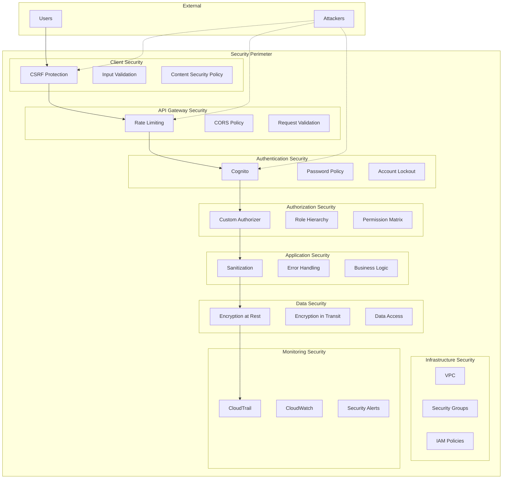
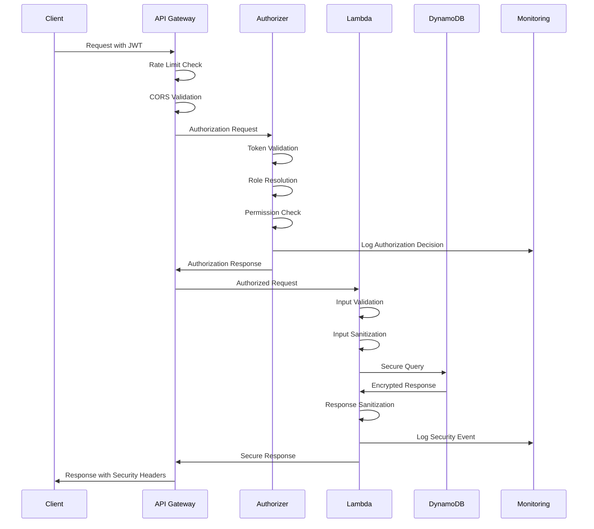

# Security Architecture Documentation

## Overview

This document provides a comprehensive overview of the security architecture implemented in the Task Management System. The architecture follows defense-in-depth principles with multiple layers of security controls to protect against various threat vectors.

## Security Architecture Layers

### 1. Client Layer Security

- **Input Validation**: Client-side validation with React components
- **CSRF Protection**: Token-based CSRF protection for all state-changing operations
- **Content Security Policy**: Strict CSP headers to prevent XSS attacks
- **Secure Session Management**: Automatic logout and secure token handling

### 2. API Gateway Layer Security

- **Rate Limiting**: Configurable throttling to prevent abuse
- **CORS Policy**: Environment-specific origin validation
- **Request Size Limits**: Protection against large payload attacks
- **Request Validation**: Schema-based request validation

### 3. Authentication Layer Security

- **AWS Cognito Integration**: Managed authentication service
- **Enhanced Password Policy**: Strong password requirements with complexity rules
- **Account Lockout**: Automated lockout after failed attempts
- **MFA Support**: Multi-factor authentication capabilities

### 4. Authorization Layer Security

- **Role Hierarchy Engine**: Comprehensive role-based access control
- **Permission Matrix**: Fine-grained permission validation
- **Custom Authorizer**: Lambda-based authorization with audit logging
- **Principle of Least Privilege**: Minimal required permissions

### 5. Application Layer Security

- **Input Sanitization**: Comprehensive sanitization of all user inputs
- **Secure Error Handling**: Information disclosure prevention
- **Business Logic Validation**: Security checks in business operations
- **Audit Logging**: Comprehensive security event logging

### 6. Data Layer Security

- **Encryption at Rest**: DynamoDB encryption with AWS managed keys
- **Encryption in Transit**: TLS 1.2+ for all communications
- **Query Optimization**: Secure and efficient data access patterns
- **Data Isolation**: User-based data segregation

### 7. Infrastructure Layer Security

- **VPC Configuration**: Network isolation for Lambda functions
- **Security Groups**: Restrictive network access controls
- **IAM Policies**: Least privilege access policies
- **Secrets Management**: AWS Secrets Manager for sensitive configuration

### 8. Monitoring Layer Security

- **CloudTrail**: Comprehensive API call logging
- **CloudWatch**: Real-time monitoring and alerting
- **Security Event Logging**: Structured security event capture
- **Automated Alerting**: Real-time security incident notifications

## Security Components

### Enhanced Authorization System

The authorization system implements a hierarchical role-based access control (RBAC) model:

```
Admin (Full Access)
├── Contributor (Read/Write Tasks)
│   └── Viewer (Read-Only Access)
```

**Key Features:**

- Role hierarchy with inheritance
- Permission matrix validation
- Multi-group membership handling
- Authorization decision logging

### Input Validation Framework

Comprehensive input validation system with:

- Schema-based validation
- Type checking and sanitization
- Length and pattern validation
- Custom validation rules

### Secure Error Handling

Error handling system that:

- Prevents information disclosure
- Provides user-friendly messages
- Logs detailed errors server-side
- Maintains audit trails

### Security Monitoring

Real-time security monitoring with:

- Security event classification
- Automated threat detection
- Incident response triggers
- Compliance reporting

## Security Controls Matrix

| Layer          | Control Type       | Implementation         | Status |
| -------------- | ------------------ | ---------------------- | ------ |
| Client         | Input Validation   | React Components       | ✅     |
| Client         | CSRF Protection    | Token-based            | ✅     |
| API Gateway    | Rate Limiting      | AWS API Gateway        | ✅     |
| API Gateway    | CORS Policy        | Environment-specific   | ✅     |
| Authentication | Password Policy    | Cognito Configuration  | ✅     |
| Authentication | Account Lockout    | Automated              | ✅     |
| Authorization  | Role Hierarchy     | Custom Engine          | ✅     |
| Authorization  | Permission Matrix  | Validation Service     | ✅     |
| Application    | Input Sanitization | Sanitization Service   | ✅     |
| Application    | Error Handling     | Secure Response System | ✅     |
| Data           | Encryption at Rest | DynamoDB KMS           | ✅     |
| Data           | Query Security     | Optimized Patterns     | ✅     |
| Infrastructure | VPC                | Network Isolation      | ✅     |
| Infrastructure | IAM                | Least Privilege        | ✅     |
| Monitoring     | CloudTrail         | API Logging            | ✅     |
| Monitoring     | Security Events    | Structured Logging     | ✅     |

## Threat Model

### Identified Threats

1. **Authentication Bypass**

   - **Mitigation**: Strong password policy, account lockout, MFA
   - **Detection**: Failed login monitoring, suspicious activity alerts

2. **Authorization Escalation**

   - **Mitigation**: Role hierarchy, permission matrix validation
   - **Detection**: Authorization decision logging, privilege change alerts

3. **Injection Attacks**

   - **Mitigation**: Input validation, sanitization, parameterized queries
   - **Detection**: Input validation logging, anomaly detection

4. **Cross-Site Attacks**

   - **Mitigation**: CORS policy, CSP headers, CSRF protection
   - **Detection**: Origin validation logging, suspicious request patterns

5. **Data Exposure**
   - **Mitigation**: Encryption, access controls, secure error handling
   - **Detection**: Data access logging, unauthorized access alerts

### Risk Assessment

| Threat                   | Likelihood | Impact | Risk Level | Mitigation Status |
| ------------------------ | ---------- | ------ | ---------- | ----------------- |
| Authentication Bypass    | Medium     | High   | High       | ✅ Mitigated      |
| Authorization Escalation | Low        | High   | Medium     | ✅ Mitigated      |
| Injection Attacks        | Medium     | Medium | Medium     | ✅ Mitigated      |
| Cross-Site Attacks       | Low        | Medium | Low        | ✅ Mitigated      |
| Data Exposure            | Low        | High   | Medium     | ✅ Mitigated      |

## Security Metrics

### Key Performance Indicators

1. **Authentication Metrics**

   - Failed login attempts per hour
   - Account lockout frequency
   - Password policy compliance rate

2. **Authorization Metrics**

   - Permission validation success rate
   - Authorization decision latency
   - Role assignment accuracy

3. **Input Validation Metrics**

   - Validation failure rate
   - Sanitization effectiveness
   - Input anomaly detection

4. **Infrastructure Metrics**
   - Security group compliance
   - IAM policy effectiveness
   - Encryption coverage

## Compliance Framework

### Security Standards Alignment

- **OWASP Top 10**: All vulnerabilities addressed
- **AWS Security Best Practices**: Infrastructure compliance
- **NIST Cybersecurity Framework**: Control implementation
- **ISO 27001**: Security management alignment

### Audit Requirements

- Quarterly security assessments
- Annual penetration testing
- Continuous compliance monitoring
- Incident response testing

## Security Architecture Diagrams

### High-Level Security Architecture



### Data Flow Security



## Security Configuration Management

### Environment-Specific Configurations

**Development Environment:**

- Relaxed CORS for localhost
- Enhanced logging for debugging
- Test data isolation
- Security testing enabled

**Production Environment:**

- Strict CORS policies
- Minimal error disclosure
- Production data protection
- Real-time monitoring

### Configuration Validation

All security configurations are validated through:

- Infrastructure as Code (CDK)
- Automated security testing
- Configuration drift detection
- Compliance checking

## Incident Response Integration

The security architecture integrates with incident response procedures through:

- Automated threat detection
- Real-time alerting
- Evidence collection
- Response automation

## Future Enhancements

### Planned Security Improvements

1. **Advanced Threat Detection**

   - Machine learning-based anomaly detection
   - Behavioral analysis
   - Threat intelligence integration

2. **Zero Trust Architecture**

   - Continuous verification
   - Micro-segmentation
   - Identity-centric security

3. **Enhanced Monitoring**
   - Security orchestration
   - Automated response
   - Threat hunting capabilities

### Technology Roadmap

- Q1: Advanced threat detection implementation
- Q2: Zero trust architecture pilot
- Q3: Enhanced monitoring deployment
- Q4: Security automation expansion

---

**Document Version**: 1.0  
**Last Updated**: 2025-01-15  
**Next Review**: 2025-04-15  
**Owner**: Security Team  
**Approved By**: Security Architect
